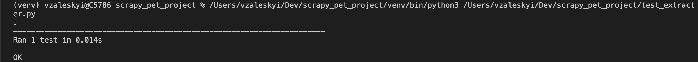

# Parse GridDynamics Blog with Scrapy and visualize it
_ _ _

## Description

Imagine you are an angry and insidious HR and you want to hunt most active and public people of Grid Dynamics. 
You will be able to use Web Crawler to parse https://blog.griddynamics.com/, obtain articles and author information from it. 
And generate a report with this information.

_ _ _

## Visuals
Here is output for unit tests:

_ _ _

## Installation
1. Install python if you don`t have on your Mac: 
$ brew install python3.6
1. Clone repo https/ssh from gitlab: 
$ git clone https://gitlab.com/vzaleskyi/scrapy_pet_project.git 
$ git clone git@gitlab.com:vzaleskyi/scrapy_pet_project.git
1. Create and start venv: 
$ python3 -m venv venv 
$ source venv/bin/activate
1. Install dependencies 
$ pi3 install -r requirements.txt
_ _ _

## Usage
To start crawler and get report use command:
$ python report.py
_ _ _

## License & Copyright
© Valentyn Zaleskyi

